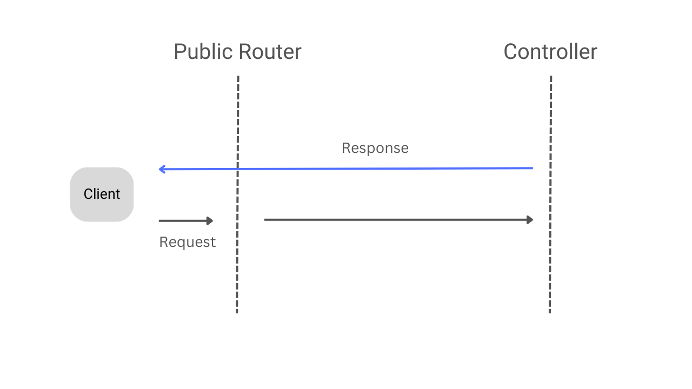
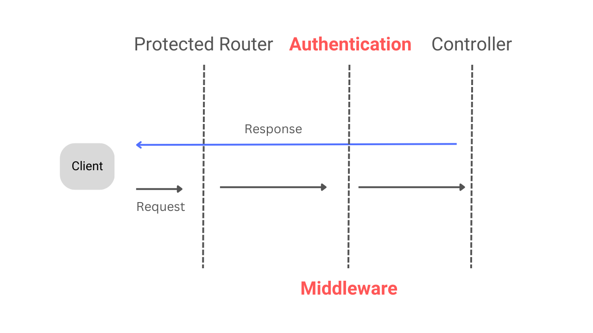

# Taiki-backend-go
A Go (Golang) Backend Clean Architecture project with Gin, MongoDB, JWT Authentication Middleware, Test, and Docker.

> The go generator is replant from [Go Backend Clean Architecture](https://www.Taiki-Server-Go)

**You can use this project as a template to build your Backend project in the Go language on top of this project.**

## Architecture Layers of the project

- Router
- Controller
- Usecase
- Repository
- Domain


## Major Packages used in this project

- **gin**: Gin is an HTTP web framework written in Go (Golang). It features a Martini-like API with much better performance -- up to 40 times faster. If you need a smashing performance, get yourself some Gin.

- **mongo go driver**: The Official Golang driver for MongoDB.

- **jwt**: JSON Web Tokens are an open, industry-standard RFC 7519 method for representing claims securely between two parties. Used for Access Token and Refresh Token.

- **viper**: For loading configuration from the `.env` file. Go configuration with fangs. Find, load, and unmarshal a configuration file in JSON, TOML, YAML, HCL, INI, envfile, or Java properties formats.

- **bcrypt**: Package bcrypt implements Provos and Mazières's bcrypt adaptive hashing algorithm.

- **testify**: A toolkit with common assertions and mocks that plays nicely with the standard library.

- **mockery**: A mock code autogenerator for Golang used in testing.

- Check more packages in `go.mod`.

### Public API Request Flow without JWT Authentication Middleware



### Private API Request Flow with JWT Authentication Middleware

> JWT Authentication Middleware for Access Token Validation.



### How to run this project?

We can run this Go Backend Clean Architecture project with or without Docker. Here, I am providing both ways to run this project.

- Clone this project

```bash
# Move to your workspace
cd your-workspace

# Clone this project into your workspace
git clone https://github.com/stevekeol/Taiki-backend-go.git

# Move to the project root directory
cd Taiki-backend-go
```

#### Run without Docker (!!!)

- Create a file `.env` similar to `.env.example` at the root directory with your configuration.
- Install `go` if not installed on your machine.
- Install `MongoDB` if not installed on your machine(`mongo --version`).
- Important: Change the `DB_HOST` to `localhost` (`DB_HOST=localhost`) in `.env` configuration file. `DB_HOST=mongodb` is needed only when you run with Docker.
- Run `go run cmd/main.go`.
- Access API using `http://localhost:10000`

#### Run with Docker

- Create a file `.env` similar to `.env.example` at the root directory with your configuration.
- Install Docker and Docker Compose.
- Run `docker-compose up -d`.
- Access API using `http://localhost:10000`

### How to run the test?

```bash
# Run all tests
go test ./...
```

### How to generate the mock code?

In this project, to test, we need to generate mock code for the use-case, repository, and database.

```bash
# Generate mock code for the usecase and repository
mockery --dir=domain --output=domain/mocks --outpkg=mocks --all

# Generate mock code for the database
mockery --dir=mongo --output=mongo/mocks --outpkg=mocks --all
```

Whenever you make changes in the interfaces of these use-cases, repositories, or databases, you need to run the corresponding command to regenerate the mock code for testing.

